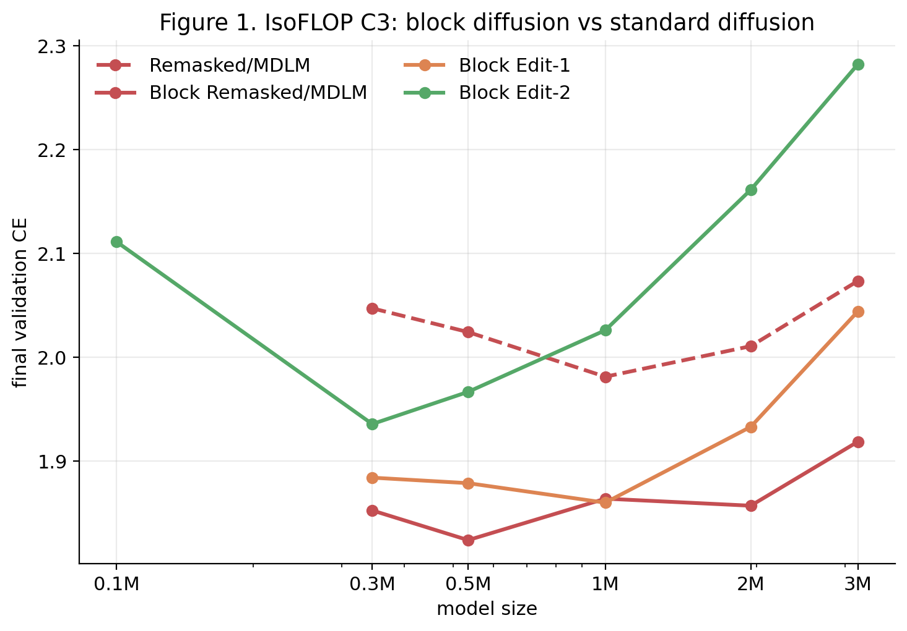
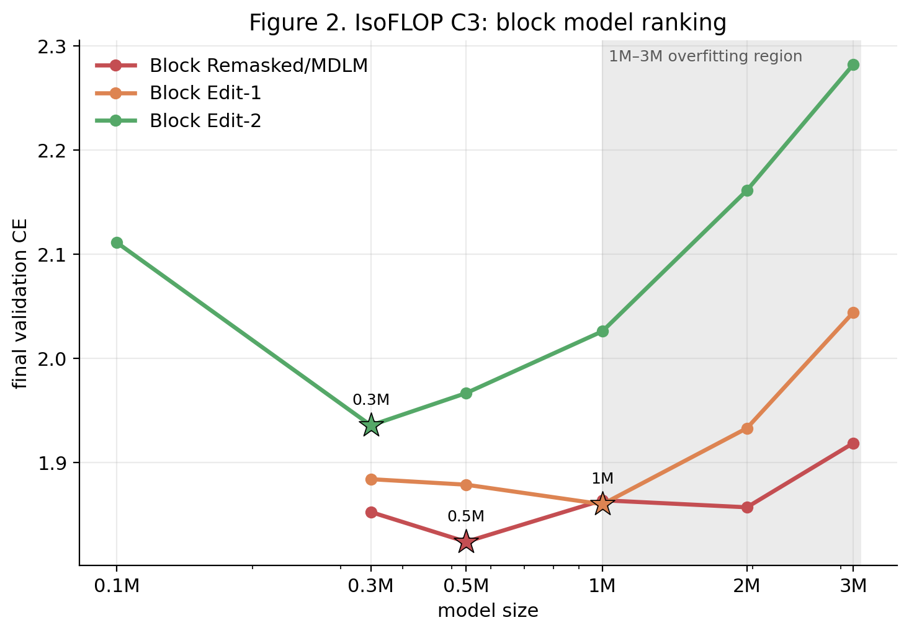
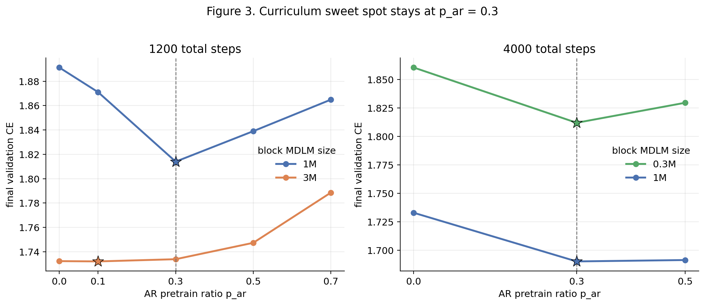
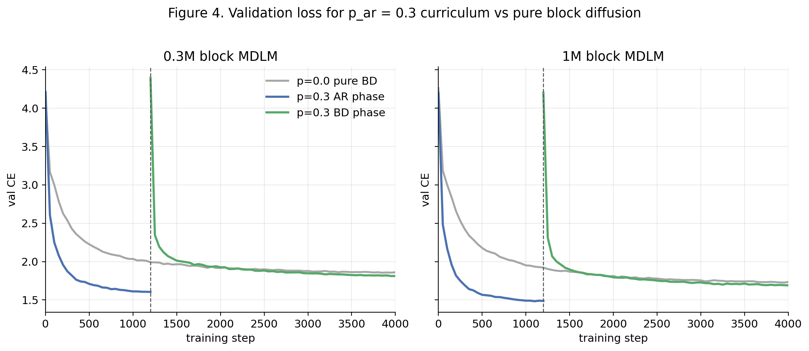

# shakespeare-dLM

Scaling laws for language diffusion models are under-studied. This repo is the first in a series that aims to push this frontier. It primarily serves learning purposes for the author; we don't claim any novelty in ideas. 

We did IsoFLOP experiments comparing different standard diffusion models as well as their block diffusion versions on TinyShakespeare (~1.1 MB, character-level). All results are generated by `reproduce.ipynb`. We then investigated the benefits of warming up with next-token prediction before increasing the block length.

## Four diffusion models

Each variant shares the same transformer backbone; they differ only in training objective and generation strategy. Each also has a **block** counterpart that splits the sequence into blocks and denoises them left-to-right with cross-block causal attention.

- **MDLM** (Masked Diffusion LM): The baseline. Trains on cross-entropy over masked positions. At generation, tokens are progressively unmasked from high to low confidence and never re-masked — once committed, a token is final.
- **Remasked**: Same training loss as MDLM, but generation allows revision: at each step the model rewrites all positions, then re-masks the least confident ones. The intuition is that allowing the model to undo mistakes should improve sample quality, especially for long-range coherence.
- **Edit-1** (one-pass self-correction): Trains on masked *and* corrupted visible tokens (15% of visible tokens are randomly replaced). This teaches the model to both fill blanks and fix errors in a single pass, so it can self-correct during generation without extra cost.
- **Edit-2** (two-pass self-correction): First pass denoises masked tokens as usual; second pass re-reads the model's own draft and corrects positions where the draft is wrong. This doubles the FLOP cost per step, but the explicit correction objective should give stronger error recovery than the implicit corruption in Edit-1.

## Result 1: Block diffusion is more FLOP-efficient than standard diffusion

At equal compute (C3 = 6e14 FLOPs), block models (bl=4) consistently outperform standard diffusion by 0.05–0.16 nats. The best block model (Block Remasked/MDLM at 0.5M) reaches val CE 1.8241, compared to 1.9814 for the best standard model (Remasked at 1M) — a 0.16-nat gap. Since Remasked and MDLM produce identical training losses, they are plotted as a single line. 



## Result 2: Block models prefer smaller sizes; larger models overfit at fixed compute

Block MDLM's IsoFLOP optimum is at 0.5M (val=1.8241), while standard MDLM's is at 1M (val=1.9861). Beyond 0.5M, block models get too few training steps for the FLOP budget (due to the 2x input cost), and val loss rises. The ranking is: Block Remasked/MDLM (1.8241) > Block Edit-1 (1.8601) > Block Edit-2 (1.9358).



## Result 3: AR pretraining helps, with a sweet spot at p=0.3

Training AR for 30% of total steps before switching to block MDLM improves val CE by 0.04–0.09 nats. At 1200 steps: -0.088 nats (0.3M), -0.077 nats (1M). At 4000 steps: -0.049 nats (0.3M), -0.043 nats (1M). The effect is U-shaped — too little AR (p=0.1) undertrains the initialization, too much (p=0.7) starves the diffusion phase.



The val loss curves show how the AR phase (blue) gives the BD phase (green) a head start over pure block diffusion (gray). After the transition at step 1200, the curriculum model stays below the baseline throughout training.



## Reproduce

```bash
pip install torch matplotlib
jupyter notebook reproduce.ipynb  # Run All — takes ~2h on A100
```

The notebook generates `data/` (loss logs) and `figures/` (the four plots above). See `memo_bd3lm_findings.md` for full methodology and hyperparameter details.

## Repo structure

```
train.py, backbone.py, block_utils.py   Core training code
model_*.py                               9 model variants (4 standard + 4 block + AR)
experiment_config.py                     Shared config (sizes, LRs, FLOP multipliers)
reproduce.ipynb                          Generates all data and figures
data.txt                                 TinyShakespeare dataset
tests/                                   Test suite
```
