# Findings: Block Diffusion Scaling on ClimbMix

Last updated: 2026-07-26

This note summarizes the ClimbMix experiments completed so far. It separates
direct measurements from fitted or extrapolated conclusions and records
negative results as well as positive ones.

## Executive summary

1. **The batch-128 pure-BD study is complete through \(10^{18}\) nominal
   FLOPs.** Its last four profiles give
   \(N_{\mathrm{opt}}\propto C^{0.472}\),
   \(D_{\mathrm{opt}}\propto C^{0.529}\), and
   \(L_{\min}\propto C^{-0.0521}\). The \(10^{18}\) optimum is 24.50M
   parameters and 2.793B clean tokens.
2. **Pure AR uses larger models and fewer tokens than full BD.** Its final
   rolling-five laws are \(N_{\mathrm{opt}}\propto C^{0.558}\) and
   \(D_{\mathrm{opt}}\propto C^{0.450}\); the \(10^{18}\) optimum is 94.70M
   parameters, 1.687B tokens, and \(D/N=17.8\).
3. **A matched-step, matched-token \(p_{\mathrm{AR}}=0.4\) curriculum is
   competitive through \(10^{18}\).** Its fitted NELBO improves over the
   pure-BD frontier by 0.71%, 0.91%, 0.39%, and 0.03% at the four
   batch-matched budgets from \(3\cdot10^{16}\) to \(10^{18}\). Because AR
   steps are cheaper, the mixed runs use only about 78% of nominal FLOPs;
   comparison to the pure-BD loss law at realized compute gives gains of
   1.90%, 2.30%, 1.82%, and 1.21%.
4. **Changing the curriculum fraction mainly shifts the compute-optimal
   allocation in the current \(3\cdot10^{17}\) test.** A targeted
   \(p_{\mathrm{AR}}=0.15\) profile fits 17.83M parameters, 1.151B tokens,
   \(D/N=64.5\), and NELBO 3.64270. It is only 0.188% below the
   \(p_{\mathrm{AR}}=0.4\) fitted loss, below the 1% decision threshold. This
   is consistent with \(p_{\mathrm{AR}}\) acting as a sample-efficiency knob,
   but one budget and one seed cannot establish equal-loss guarantees.
5. **The predict-next-and-bracket strategy localizes shallow optima with
   relatively few points, but the prediction is not exact.** For
   \(p_{\mathrm{AR}}=0.4\), the eight finalized next-budget forecasts have
   14.7% median absolute model-size error and 75% fall within 25%. Boundary
   checks and roughly 1.25x extensions are still required.
6. **Phase-specific learning rates track the standalone objectives.** At high
   scale, AR uses `2.7e-3` through 68.5M and `9e-4` from 85.8M onward, while
   BD remains at `9e-4`. Curriculum uses those same AR/BD rates with an
   optimizer reset and a new WSD schedule at the transition.
7. **The older fixed-size experiments remain useful diagnostics.** At fixed
   FLOPs and model size, curriculum often helps an oversized, undertrained
   model; re-optimizing model size absorbs much of the gain. At 10M
   parameters and fixed \(D/N=40\), block length 4 prefers pure BD, while
   block length 32 prefers \(p_{\mathrm{AR}}=0.1\) by 0.02390 NELBO.

The strongest current interpretation is therefore:

> AR pretraining changes the favorable model/data allocation and can preserve
> essentially the same BD frontier loss with fewer accounted FLOPs. The exact
> curriculum fraction appears less important than re-optimizing model size,
> but the observed sub-1% differences are too small for a single-seed study to
> establish equivalence.

## Experimental setup

### Data and tokenizer

- Source: `karpathy/climbmix-400b-shuffle`, a shuffled raw-text conversion of
  NVIDIA ClimbMix.
- Prepared training data: shards 1–90, containing 5,776,049,323 tokens. The
  completed historical study used shards 1–25 (1,606,235,727 tokens).
- Validation data: shard 0, containing 64,398,934 tokens.
- Training is one-pass: a run reads a deterministic prefix and never wraps.
- Tokenizer: byte-level BPE with 8,192 base tokens plus one diffusion-only
  `<|mask|>` token, for a total vocabulary of 8,193.
- The tokenizer was trained on training shards 1–4.

### Model and objective

The primary model grid uses bias-free Llama-2-style transformers with
RMSNorm, RoPE, full multi-head attention, SwiGLU, no dropout, and head
dimension 16. Counted
parameters exclude the input embedding but include the untied LM head and
learned norms.

| label | layers | width | heads | FFN | counted parameters |
|---|---:|---:|---:|---:|---:|
| 0.14M | 2 | 16 | 1 | 48 | 137,824 |
| 0.29M | 2 | 32 | 2 | 88 | 287,424 |
| 0.5M | 4 | 48 | 3 | 128 | 504,288 |
| 1M | 4 | 80 | 5 | 216 | 965,920 |
| 2M | 7 | 112 | 7 | 304 | 1,985,536 |
| 4M | 11 | 144 | 9 | 384 | 3,920,256 |
| 8M | 12 | 208 | 13 | 560 | 7,979,296 |
| 10M* | 13 | 224 | 14 | 600 | 9,692,032 |

`10M*` is an experimental extension used only for the fixed-\(D/N=40\)
block-length follow-up. It is not part of the completed pure-BD IsoFLOP grid.

Block diffusion uses a BD3-style dual stream \([x_t\mid x_0]\), sequence
length 256 per stream, and diffusion blocks of four tokens. A noisy block can
attend bidirectionally within itself and to clean preceding blocks, but never
to its clean target block or future blocks. The loss is importance-weighted
masked cross-entropy estimating diffusion NELBO.

All main runs use batch size 64, or 16,384 clean tokens per optimizer step;
AdamW with betas `(0.9, 0.95)`; matrix weight decay 0.1; gradient clipping 1.0;
BF16; seed 1337; and one H100. The WSD schedule is 5% warmup, 80% stable, and
15% linear decay.

### Compute accounting

For clean sequence length \(L=256\), the leading dense training FLOPs per
clean token are

```text
F_token = 12*P_layers + 48*L*n_layer*d_model + 6*d_model*8193.
```

This includes forward/backward transformer matrices on both streams, dense
attention over the complete dual stream, and the LM head on noisy positions.
The experiment uses dense scaled-dot-product attention, so logically masked
pairs are not discounted.

\(N_{\mathrm{eff}}\) is a compute-equivalent parameter count:

```text
N_eff = F_token / 12
C     = 12 * N_eff * D.
```

It is not the number of learned weights. It packages layer matrices,
sequence-length-dependent attention, and the LM head into the parameter count
that would give the same FLOPs under the dual-stream `12*N*D` approximation.

## 1. Pure-BD IsoFLOP scaling

The sweep used \(C=\{10^{14},3\cdot10^{14},10^{15},3\cdot10^{15},10^{16}\}\)
FLOPs. Every feasible \((C,N)\) point received its own geometric 3x LR sweep,
and the LR was selected from complete WSD runs. All 25 selected points have a
positive two-sided LR bracket.

The primary IsoFLOP profile is an L2 quadratic in \(\log_{10}N\) through the
three lowest measured losses at each compute budget. Restricting the fit to
the local three-point basin was substantially more faithful than forcing one
quadratic through the entire profile.

| FLOPs | fitted optimal \(N\) | fitted \(D\) | \(D/N\) | fitted minimum NELBO |
|---:|---:|---:|---:|---:|
| \(10^{14}\) | 0.237M | 45.7M | 192.5 | 5.6784 |
| \(3\cdot10^{14}\) | 0.366M | 79.3M | 217.0 | 5.4310 |
| \(10^{15}\) | 0.875M | 95.3M | 108.8 | 5.0239 |
| \(3\cdot10^{15}\) | 1.152M | 208.9M | 181.3 | 4.7254 |
| \(10^{16}\) | 2.561M | 270.0M | 105.4 | 4.4448 |

The global power-law fits, normalized at \(10^{15}\) FLOPs, are

```text
N_opt(C)     = 7.5e5 * (C / 1e15)^0.514
N_eff,opt(C) = 7.2e5 * (C / 1e15)^0.608
D_opt(C)     = 1.2e8 * (C / 1e15)^0.392
L_min(C)     = 5.03  * (C / 1e15)^-0.0547
```

Full-profile L1 and L2 sensitivity fits give counted-parameter exponents
0.513 and 0.536 respectively, so the near-square-root allocation is not an
artifact of the chosen local fit. Adding an irreducible-loss intercept did
not improve the five-budget scaling fit: the fitted floor collapsed to zero.

The nonconstant \(D/N\) should not yet be interpreted as a new asymptotic
law. These are small models, only five budgets are available, architecture
changes are discrete, and attention plus the large LM head are non-negligible.

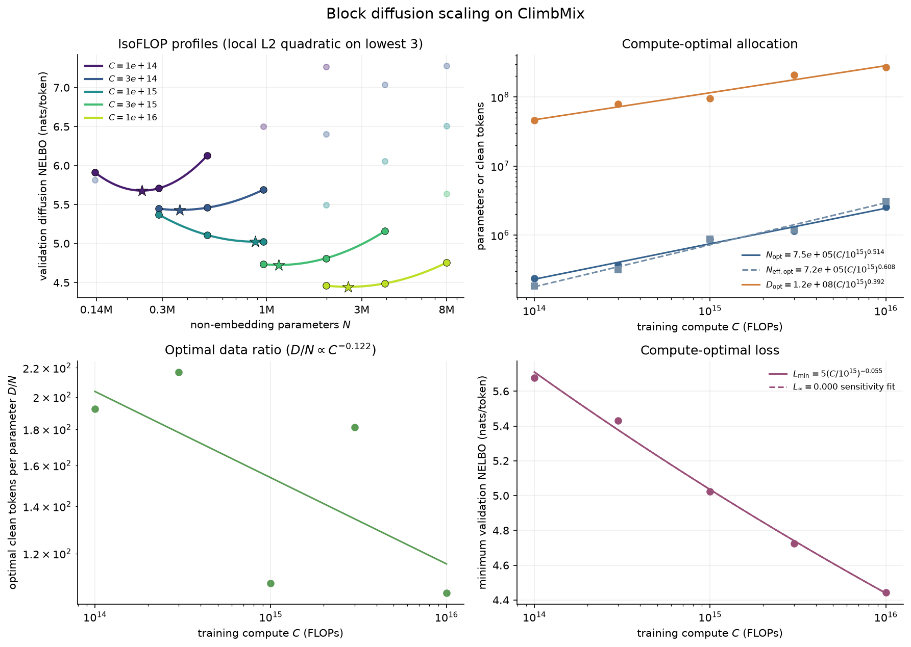

## 2. Curriculum at fixed FLOPs

The first curriculum experiment swept
\(p_{\mathrm{AR}}=\{0.1,0.2,\ldots,0.6\}\) at every feasible \((C,N)\), using
the frozen pure-BD LR from that exact point. There were 150 mixed runs and 25
pure-AR endpoints.

Here \(p_{\mathrm{AR}}\) is the fraction of optimizer steps, while total FLOPs
are fixed. Because a single-stream AR step is cheaper than a dual-stream BD
step, increasing \(p_{\mathrm{AR}}\) increases the total number of steps and
clean tokens. Consequently this experiment measures the combined benefit of:

1. an AR-learned representation before BD adaptation; and
2. buying more updates and data exposure with cheaper AR steps.

The fitted compute-optimal envelopes and best actually measured grid points
were:

| FLOPs | fitted best \(p_{\mathrm{AR}}\) | fitted gain | measured best \(p_{\mathrm{AR}}\) | measured gain |
|---:|---:|---:|---:|---:|
| \(10^{14}\) | 0.4 | 0.3798 | 0.5 | 0.1667 |
| \(3\cdot10^{14}\) | 0.6 | 0.2473 | 0.2 | 0.1745 |
| \(10^{15}\) | 0.4 | 0.2843 | 0.3 | 0.0853 |
| \(3\cdot10^{15}\) | 0.3 | 0.0081 | 0.6 | 0.0015 |
| \(10^{16}\) | 0.5 | 0.0291 | 0.4 | 0.0439 |

The fitted gains at low compute are visibly more optimistic than the
measurements. Some curriculum quadratics dip below every observed point, and
the pure-BD robust fit can discount a low measured sample. The measured
envelope is therefore the safer scientific summary.

At a fixed model size, the curriculum helps most when the model is too large
for the available compute. At \(10^{16}\) FLOPs, for example, 2M prefers pure
BD, 4M has an interior optimum near \(p_{\mathrm{AR}}=0.4\), and 8M is still
improving at 0.6. Once model size is re-optimized, most of this gain
disappears: the curriculum primarily shifts the preferred model toward a
larger, otherwise undertrained model.

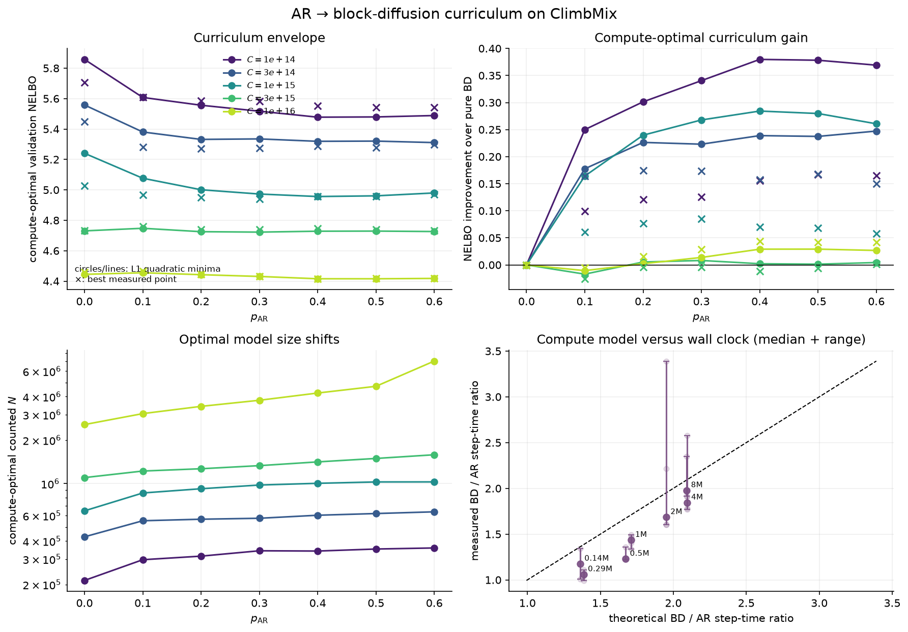

## 3. Curriculum at matched optimizer steps and tokens

The second curriculum experiment was designed to remove the extra-update
advantage. For each model size, the pure-BD allocation law was inverted to
find the compute budget at which that model should be optimal. The resulting
pure-BD clean-token count was converted to a total number of steps. Every
AR-to-BD branch then used exactly that same number of optimizer steps and
clean tokens, with \(p_{\mathrm{AR}}\) changing only how the steps were split.

The AR optimizer state is discarded at transition. The BD phase starts a
fresh AdamW optimizer and a fresh 5%/80%/15% WSD schedule. AR branches include
their own terminal decay; their common warmup is 5% of the shortest
\(p_{\mathrm{AR}}=0.1\) AR phase so warmup is not excessive for short phases.

Completed measured results are:

| model | total steps | pure-BD LR | best \(p_{\mathrm{AR}}\) | best nonzero gain |
|---|---:|---:|---:|---:|
| 0.14M | 1,794 | 8.1e-3 | 0.1 | +0.2106 |
| 0.29M | 3,552 | 8.1e-3 | 0.2 | +0.0138 |
| 0.5M | 4,668 | 2.7e-3 | 0.1 | +0.0944 |
| 1M | 8,633 | 2.7e-3 | 0.0 | -0.0274 |
| 2M | 14,549 | 9.0e-4 | 0.0 | -0.0205 |

The 0.14M target is an extrapolation below the original IsoFLOP compute range,
so its unusually large gain is less reliable. The 0.29M gain is small enough
to require repeated seeds before treating it as robust. The 0.5M gain is
clear and broad across \(p_{\mathrm{AR}}=0.1\)–0.3. At both 1M and 2M, however,
every tested nonzero fraction is worse than uninterrupted BD.

For the 2M baseline, 2.7e-3 achieved NELBO 4.5471 and 9e-4 achieved 4.5560.
We selected 9e-4 because the 0.0089 difference was judged likely seed noise
and 9e-4 agrees with the neighboring fixed-size LR trend. This is a deliberate
near-tie choice, not a claimed locally convex LR optimum.

The 4M pure-BD baseline completed with 9e-4 selected from a restricted
two-point sweep, but its curriculum sweep was not started. The 8M baseline
was terminated to obtain results sooner. Thus the matched-step conclusion is
currently limited to models through 2M.

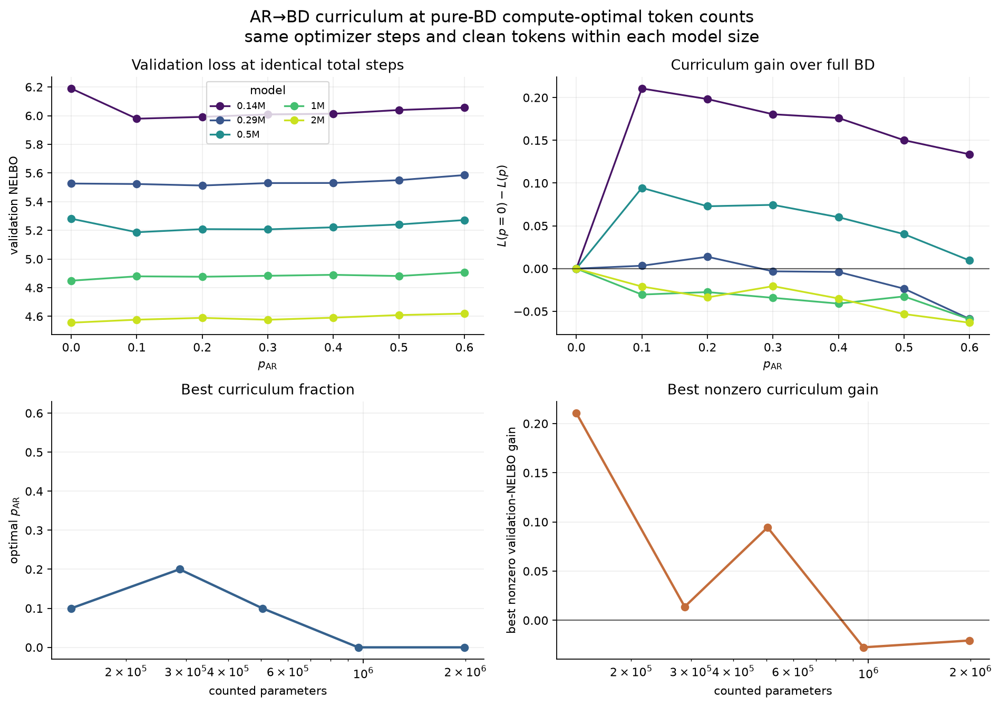

## 4. Block length and curriculum at 10M

A fixed-token follow-up tested whether the usefulness of AR curriculum changes
with diffusion task difficulty. The experimental 9,692,032-parameter model
received 387,678,208 clean tokens, or \(D/N=39.9997\), over 23,662 optimizer
steps. Block lengths 4 and 32 each used
\(p_{\mathrm{AR}}=\{0,0.1,0.3,0.5,0.7\}\). All points used peak LR 9e-4,
weight decay 0.1, one shared AR trunk, an optimizer reset at transition, and a
fresh 5%/80%/15% WSD schedule for BD.

| block length | p=0.0 | p=0.1 | p=0.3 | p=0.5 | p=0.7 |
|---:|---:|---:|---:|---:|---:|
| 4 | 4.02699 | 4.04424 | 4.03974 | 4.07522 | 4.11789 |
| 32 | 4.17478 | **4.15088** | 4.16442 | 4.20112 | 4.27510 |

For block length 4, every nonzero AR fraction hurts; the least harmful is
\(p_{\mathrm{AR}}=0.3\), still 0.01275 worse than pure BD. For block length
32, \(p_{\mathrm{AR}}=0.1\) improves NELBO by 0.02390 and
\(p_{\mathrm{AR}}=0.3\) improves it by 0.01036, while larger fractions hurt.
Thus the measured block-32 optimum is locally bracketed on the requested grid.

This is consistent with the larger block making BD harder and leaving the
model undertrained relative to its objective. Because tokens and total steps
are matched, the gain is not extra data exposure: the AR prefix supplies an
easier representation-learning signal. This interpretation remains a
single-seed result at one model size and token ratio, so it establishes a
block-length interaction rather than its scaling law.

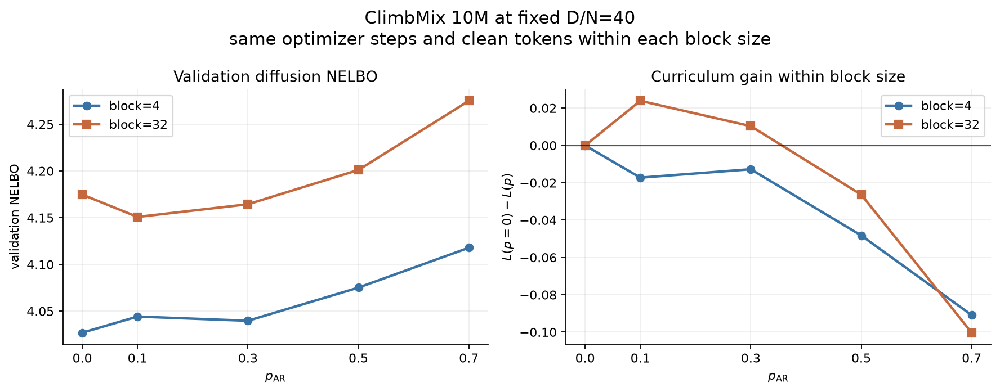

## 5. Transition diagnostics

Several fast diagnostics tested explanations for curriculum underperformance.

### AR learns useful features, but not enough to beat uninterrupted BD

At \(C=10^{15}\), 0.5M parameters, an AR prefix followed by an identical BD
tail improves validation NELBO from 5.1932 for a random initialization to
5.1428. Thus the AR representation is useful to BD. Nevertheless,
uninterrupted pure BD reaches 5.1095, so replacing early BD work with AR still
loses overall at this data-rich point.

An AR prefix of roughly 20 tokens per parameter does not close the gap. This
argues against a simple threshold such as “train AR to Chinchilla's 20x ratio,
then switch.”

### AR end decay is not the culprit

Removing the decay at the end of AR was neutral to slightly harmful:

- at 0.5M and \(10^{15}\) FLOPs, removing decay worsened NELBO by about
  0.002–0.005 for \(p_{\mathrm{AR}}=0.06\) and 0.10;
- at 2M and \(10^{16}\) FLOPs, \(p_{\mathrm{AR}}=0.1\) changed from 4.4845
  with decay to 4.4875 without it.

### Separate AR-LR tuning has negligible effect

At 0.5M and \(3\cdot10^{14}\) FLOPs, a 3x AR-LR sweep was performed for every
curriculum fraction. Five of six cells retained 2.7e-3. Only
\(p_{\mathrm{AR}}=0.2\) selected 9e-4, by less than 0.001 NELBO. Per-cell AR-LR
tuning therefore does not materially change \(L(p)\).

At 0.5M and \(10^{15}\) FLOPs, lowering the post-transition BD LR from 8.1e-3
to 2.7e-3 helped by about 0.009, but the curriculum still remained worse than
pure BD. Transition-specific BD tuning may matter modestly, but it does not
explain the main effect.

### Optimizer reset is unresolved

All main curriculum branches reset AdamW state at the AR-to-BD transition.
This creates a real adaptation cost, especially when the remaining BD phase is
short. The experiments above show that AR decay and AR LR are not the root
cause, but they do not isolate optimizer-state reset. A no-reset experiment
would need to specify whether the LR schedule and optimizer step counter also
continue across the objective switch, and remains future work.

## 5. Overfitting and optimization behavior

Data reuse is not driving the observed curriculum pattern:

- the largest fixed-FLOP mixed run uses 0.315 training epochs;
- the largest pure-AR endpoint uses 0.435 epochs;
- the largest completed matched-step run through 2M uses about 0.148 epochs.

Selected pure-BD training traces show no persistent U-shaped train NELBO
characteristic of data overfitting. The stable phase generally continues to
improve or fluctuates around a slowly improving trend, and the terminal decay
usually gives an additional loss reduction. Individual minibatch traces are
noisy, so small phase-to-phase differences should not be overinterpreted.

## 6. Wall-clock and implementation findings

Measured BD/AR time ratios approach the architecture-aware FLOP prediction as
model size increases:

| model | theoretical BD/AR | measured median BD/AR |
|---|---:|---:|
| 0.14M | 1.362 | 1.175 |
| 0.29M | 1.386 | 1.060 |
| 0.5M | 1.673 | 1.229 |
| 1M | 1.710 | 1.435 |
| 2M | 1.952 | 1.685 |
| 4M | 2.094 | 1.844 |
| 8M | 2.092 | 1.978 |

At 8M, the measured 1.98x ratio nearly matches the predicted 2.09x. Tiny
models have lower ratios because fixed launch and kernel overhead makes the
single-stream AR step relatively inefficient.

Four concurrent small-model jobs saturated the H100 and substantially reduced
wall-clock time. A 2M FlexAttention benchmark was numerically consistent with
the dense SDPA implementation but improved full-step wall time by only 4.0%
(100.57 ms to 96.71 ms). We retained simple SDPA to avoid adding complexity
and changing the implementation midway through the study.

## 7. Pure-BD scale-up through 1e18

The batch-128 extension is complete through \(10^{18}\) FLOPs. Forecasting
uses the five highest-compute bracketed optima, and every new profile is
fitted only after the measured minimum has both an immediate lower and upper
neighbor.

| FLOPs | forecast \(N\) | fitted \(N\) | fitted \(D\) | \(D/N\) | fitted NELBO |
|---:|---:|---:|---:|---:|---:|
| \(3\cdot10^{16}\) | 4.303M | 4.416M | 0.463B | 104.9 | 4.14035 |
| \(10^{17}\) | 8.346M | 9.338M | 0.729B | 78.1 | 3.88064 |
| \(3\cdot10^{17}\) | 15.536M | 13.087M | 1.568B | 119.8 | 3.66372 |
| \(10^{18}\) | 28.229M | 24.501M | 2.793B | 114.0 | 3.44915 |

The first two forecasts missed the fitted vertex by -2.6% and -10.6% while
remaining inside their initial neighborhoods. The \(3\cdot10^{17}\) forecast
overshot by 18.7%, and the initial four-size profile was still descending at
12.3M. Parallel 10.3M and 8.5M extensions then bracketed the minimum. Its
local quadratic uses 10.3M/12.3M/15.5M and has a 13.087M vertex. At
\(10^{18}\), the forecast overshot by 15.2% but remained within one model-size
grid step of the fitted optimum. Across the four scale-up budgets the median
absolute forecast error is 12.9%. This is the important success criterion for
the adaptive design: the forecast centers an efficient neighborhood, while a
miss triggers more measurement instead of an edge extrapolation.

Through \(10^{18}\), the rolling highest-five allocation laws are

```text
N_opt(C) = 7.73M * (C / 1e17)^0.532
D_opt(C) = 0.890B * (C / 1e17)^0.462.
```

The four batch-128 points alone give exponents 0.472 and 0.529,
respectively, close to symmetric square-root allocation. The all-budget
sensitivities are 0.509 and 0.437. These high-scale results support the
direction of the square-root hypothesis, although \(D/N\) remains visibly
noisy.

The higher-LR batch-transition probe (`2.7e-3`) was 0.99% worse than `9e-4`,
and the \(10^{17}\) lower-LR probe (`3e-4`) was 1.99% worse. Both were
rejected under the preregistered 1% validation threshold. No probe was
triggered at \(3\cdot10^{17}\). At \(10^{18}\), the 28.1M `3e-4` probe
improved validation NELBO by only 0.49%, so `9e-4` remained selected and no
outer sizes were repeated. The final locally fitted support is
22.3M/24.3M/28.1M.

Four independent one-GPU jobs remain the latency-optimal schedule. The
four-way DDP smoke test achieved only 230k aggregate clean tokens/s because
global batch 128 becomes local batch 32, versus 349k for the comparable cold
single-GPU run and 603k for a cache-warm long run. Accounted one-GPU MFU
improves with size: 5.9–6.7% at \(3\cdot10^{16}\), 8.0–8.8% at
\(10^{17}\), 9.6–11.4% at \(3\cdot10^{17}\), and 9.6–12.6% at
\(10^{18}\).

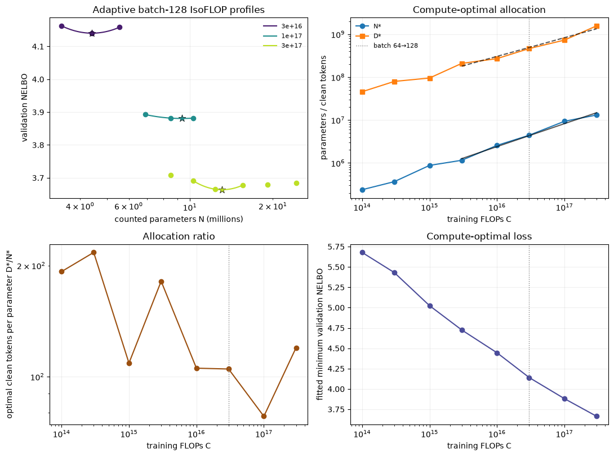

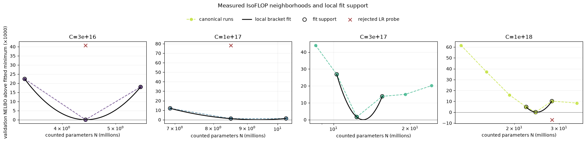

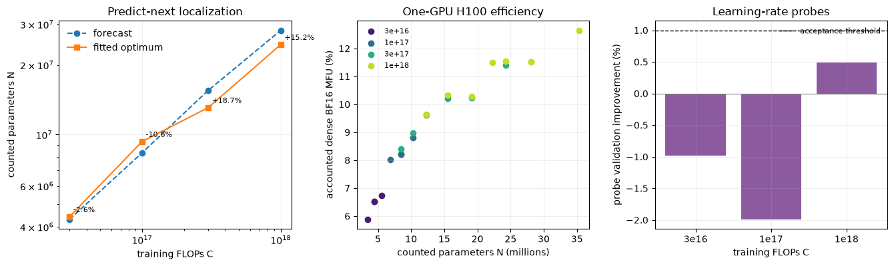

A targeted historical refinement retained batch size 64 rather than mixing
the batch-128 regime into old curves. Existing measurements formed each
initial bracket, and an approximately 1.25x neighbor was added only when the
measured minimum moved in that direction. Ambiguous LR-transition sizes
received limited 3x probes with the same 1% acceptance rule. The 0.21M
interpolation uses one 24-dimensional attention head; all other selected
refinement models keep head dimension 16.

| FLOPs | refined \(N\) | refined \(D\) | \(D/N\) | refined NELBO |
|---:|---:|---:|---:|---:|
| \(10^{14}\) | 0.249M | 43.6M | 174.9 | 5.63461 |
| \(3\cdot10^{14}\) | 0.379M | 84.9M | 224.0 | 5.26011 |
| \(10^{15}\) | 0.841M | 99.2M | 118.0 | 4.99174 |
| \(3\cdot10^{15}\) | 1.178M | 203.5M | 172.8 | 4.69197 |
| \(10^{16}\) | 1.973M | 360.1M | 182.5 | 4.46028 |

The refined historical laws are
\(N_{\mathrm{opt}}\propto C^{0.459}\) and
\(D_{\mathrm{opt}}\propto C^{0.442}\). Every vertex lies between the
immediate measured neighbors of the profile winner. These points reduce
discretization error in the all-budget sensitivity fit; the rolling
high-five law remains the primary extrapolator.

The new scale follow-ups deliberately supersede the old batch-64 curriculum
endpoints as scaling-law measurements. Pure AR uses batch 128 at all nine
budgets, exact triangular causal FlashAttention accounting, and a `D/N=20`
initial anchor with adaptive approximately 1.25x neighbors. It is complete
through \(10^{18}\):

| FLOPs | fitted \(N\) | fitted \(D\) | \(D/N\) | fitted AR CE |
|---:|---:|---:|---:|---:|
| \(10^{14}\) | 0.539M | 0.028B | 52.3 | 4.88884 |
| \(3\cdot10^{14}\) | 0.874M | 0.053B | 60.2 | 4.55691 |
| \(10^{15}\) | 1.885M | 0.080B | 42.6 | 4.17734 |
| \(3\cdot10^{15}\) | 3.551M | 0.128B | 36.2 | 3.84976 |
| \(10^{16}\) | 7.748M | 0.199B | 25.6 | 3.56870 |
| \(3\cdot10^{16}\) | 12.559M | 0.371B | 29.5 | 3.37249 |
| \(10^{17}\) | 19.831M | 0.787B | 39.7 | 3.17593 |
| \(3\cdot10^{17}\) | 52.042M | 0.913B | 17.5 | 3.01530 |
| \(10^{18}\) | 94.697M | 1.687B | 17.8 | 2.79969 |

The rolling law did not accurately predict every vertex: in particular, its
\(3\cdot10^{17}\) seed was near 35M. The boundary check triggered upper
extensions and localized the minimum with 43.7M/54.5M/68.5M support. Thus the
strategy is effective as an adaptive search but only moderately accurate as
a point predictor. The profile is also shallow: the 43.7M and 54.5M losses
differ by only 0.0041 CE, so the measured basin is more certain than its exact
quadratic vertex. The final rolling-highest-five fit is

```text
N_opt(C) = 25.16M * (C / 1e17)^0.558
D_opt(C) = 0.623B * (C / 1e17)^0.450.
```

It predicted about 87M at \(10^{18}\). At the incumbent `2.7e-3`,
68.5M/85.8M/107.7M measured 2.85163/2.86248/2.86609, leaving the profile
unbracketed on its low side. The model-size-triggered 85.8M `9e-4` probe
measured 2.80447, a 2.03% improvement, so it cleared the 1% validation
threshold. The lower LR is propagated to 85.8M and larger models; 43.7M and
54.5M remain below that transition and retain `2.7e-3`. Accepted-LR repeats
at 107.7M and 134.8M reached 2.80790 and 2.80825, respectively, giving a
68.5M/85.8M/107.7M bracket and a 94.7M fitted vertex. The forecast was 8.2%
low. Across the seven next-budget forecasts the median absolute model-size
error is 11.8%; every profile was nevertheless localized by the boundary
checks and adaptive extensions.

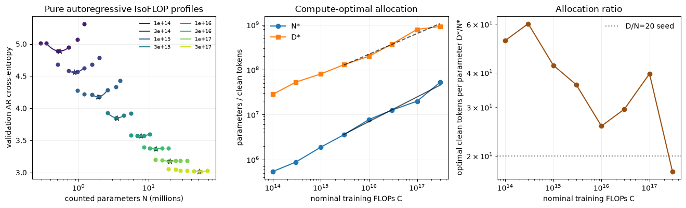

A separate batch-128 `p_AR=0.4` study holds
pure-BD steps and tokens fixed, resets AdamW at the transition, and reports
both nominal pure-BD-equivalent and realized mixed FLOPs. The preregistered
neighborhoods and model-growth-triggered 3x LR checks are in
`followup_isoflop_plan.json`.

The study is complete through \(10^{18}\):

| FLOPs | fitted \(N\) | fitted \(D\) | \(D/N\) | fitted NELBO | realized/nominal |
|---:|---:|---:|---:|---:|---:|
| \(10^{14}\) | 0.258M | 0.042B | 162.2 | 5.54300 | 0.875 |
| \(3\cdot10^{14}\) | 0.439M | 0.070B | 159.1 | 5.28783 | 0.863 |
| \(10^{15}\) | 0.846M | 0.099B | 116.4 | 4.95069 | 0.818 |
| \(3\cdot10^{15}\) | 1.015M | 0.236B | 232.4 | 4.70341 | 0.810 |
| \(10^{16}\) | 2.129M | 0.325B | 152.5 | 4.42700 | 0.783 |
| \(3\cdot10^{16}\) | 6.211M | 0.328B | 52.8 | 4.11096 | 0.777 |
| \(10^{17}\) | 10.563M | 0.646B | 61.1 | 3.84540 | 0.776 |
| \(3\cdot10^{17}\) | 23.612M | 0.869B | 36.8 | 3.64954 | 0.775 |
| \(10^{18}\) | 46.117M | 1.531B | 33.2 | 3.44823 | 0.778 |

The \(10^{18}\) sweep measured 28.1M, 35.3M, 43.7M, 54.5M, 68.5M, and
85.8M. The locally fitted vertex uses 35.3M/43.7M/54.5M support, so it is not
an edge extrapolation. The final rolling-five fit is

```text
N_opt(C) = 0.000101 * C^0.649
D_opt(C) = 571.4 * C^0.355.
```

The token exponent is sensitive to the transitional \(10^{16}\) profile,
whose fitted \(D/N\) is 152.5. Fitting the final four high-compute profiles
instead gives exponents 0.586 and 0.424, with log-space R-squared 0.992 and
0.985. This is the preferred extrapolation window for one further decade:
three points are too responsive to a single shallow vertex, while five pull
in the visibly transitional \(10^{16}\) allocation.

The batch-matched comparison to pure BD is:

| FLOPs | pure-BD NELBO | \(p_{\mathrm{AR}}=0.4\) NELBO | nominal gain | realized-FLOP-adjusted gain |
|---:|---:|---:|---:|---:|
| \(3\cdot10^{16}\) | 4.14035 | 4.11096 | 0.71% | 1.90% |
| \(10^{17}\) | 3.88064 | 3.84540 | 0.91% | 2.30% |
| \(3\cdot10^{17}\) | 3.66372 | 3.64954 | 0.39% | 1.82% |
| \(10^{18}\) | 3.44915 | 3.44823 | 0.03% | 1.21% |

The nominal gain asks whether curriculum improves loss for the same updates
and clean tokens. The adjusted gain instead compares against the batch-128
pure-BD loss law at the mixed run's realized compute. Both are fitted
single-seed comparisons. They support compute efficiency, but do not by
themselves demonstrate that the tiny nominal differences are reproducible.

At \(3\cdot10^{17}\), a six-size targeted \(p_{\mathrm{AR}}=0.15\) profile
fits \(N=17.835\)M, \(D=1.151\)B, \(D/N=64.5\), and NELBO 3.64270 using
15.5M/19.1M/22.3M support. This is 0.188% lower than the
\(p_{\mathrm{AR}}=0.4\) fit and 0.574% lower than pure BD. Since the
curriculum-to-curriculum difference is below the 1% threshold, it is better
read as evidence for a shallow allocation/loss tradeoff than as a winner.

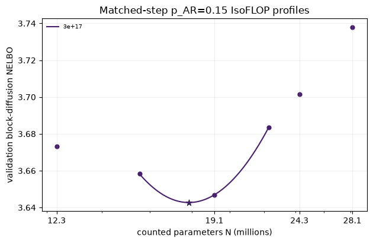

A fixed-size check at \(3\cdot10^{17}\) and 19.1M parameters then held the
seed, batch, total steps, clean tokens, and phase LRs fixed:

| \(p_{\mathrm{AR}}\) | validation NELBO | gain over pure BD | realized/nominal FLOPs |
|---:|---:|---:|---:|
| 0.00 | 3.67873 | 0.00% | 1.000 |
| 0.10 | 3.68820 | -0.26% | 0.944 |
| 0.15 | 3.64686 | +0.87% | 0.916 |
| 0.20 | 3.64951 | +0.79% | 0.888 |
| 0.40 | 3.66073 | +0.49% | 0.776 |

The 0.15 and 0.20 losses differ by only 0.00265 NELBO, and every improvement
over pure BD remains below the 1% threshold. The \(p=0.10\) result also shows
that loss is not invariant to fraction at a fixed model size. The stronger
sample-efficiency-knob interpretation therefore remains a hypothesis about
the re-optimized frontier, not a guarantee implied by this sensitivity
curve.

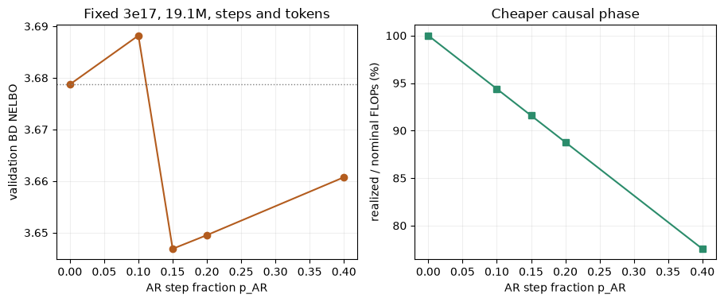

The high-scale LR choices transfer cleanly by objective. Pure AR and the AR
phase use `2.7e-3` through 68.5M, then `9e-4` at 85.8M and above. Pure BD and
the BD phase use `9e-4`. Curriculum resets AdamW and restarts a phase-local
5%/80%/15% WSD schedule, so the rates are not forced to be equal.

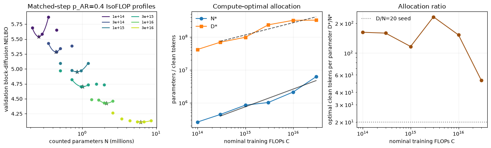

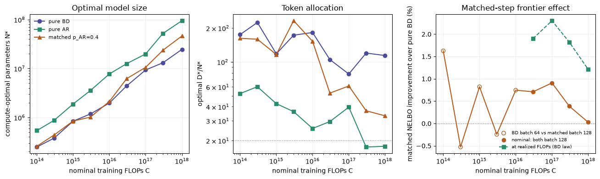

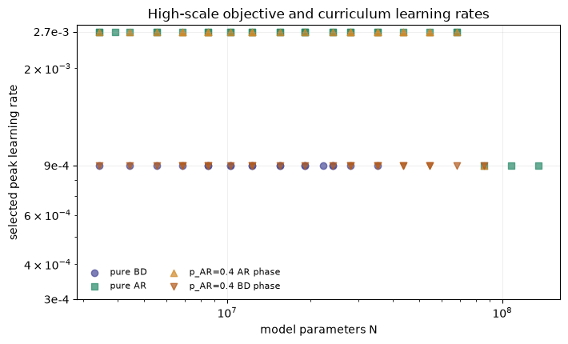

### Completed one-shot \(10^{19}\) run

The preferred last-four profile fit predicted \(N=176.137\)M,
\(D=4.072\)B, and validation NELBO 3.06743. The completed architecture has
43 layers, width 576, 36 heads, SwiGLU width 1536, and 175,965,696 counted
parameters. Thus the chosen \(N\) was 0.10% below the forecast. Its 4.189B
clean tokens were 2.89% above forecast, giving \(D/N=23.81\).

The user-selected global batch 256 changed the plan from 127,847 batch-128
steps to 63,923 updates while preserving essentially the same clean-token
exposure. The exact schedule used 25,569 AR and 38,354 BD steps, with peak
LRs `9e-4` and `3e-4`. Realized mixed compute was
\(7.833\cdot10^{18}\) FLOPs, or 0.7833 of the nominal pure-BD-equivalent
budget.

Validation NELBO was **3.00472** and masked CE at \(t=0.5\) was 2.93218.
The NELBO is 0.06271 (2.04%) below the preferred 3.06743 prediction. It is
also below the adjacent rolling-three and rolling-five predictions by 2.82%
and 0.74%, respectively. This is a successful prediction of a performant
allocation, but one model size cannot locate the \(10^{19}\) parabola or
prove that 176M is compute-optimal. The batch-256 and BD-LR changes also mean
the loss residual is not a clean test of the batch-128 scaling law alone.

Four-process NCCL DDP completed without OOM in 3.034 hours. Accounted H100
BF16 MFU was 18.31% for AR, 18.09% for BD, and 18.14% overall, corresponding
to 717.6 aggregate accounted TFLOP/s. Validation took 7.6 seconds. The W&B
run is
[9i0qqczf](https://wandb.ai/y38283929-uc-berkeley-electrical-engineering-computer-sc/climbmix-isoflop-scaleup/runs/9i0qqczf).

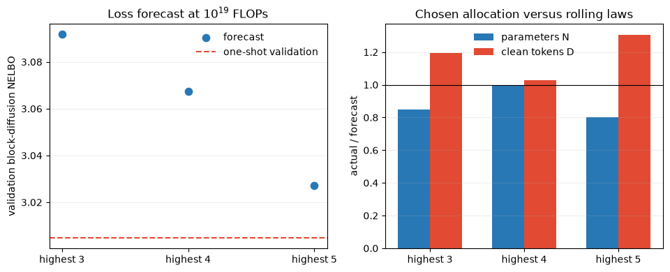

### Fixed-25M-token data-efficiency result

The fixed dataset contains 25,001,984 unique training tokens, and the model
has 50,249,664 counted parameters. Global batch size was 128 throughout. The
full-BD stable trunk saved every five epochs; each checkpoint at epoch \(T\)
was independently decayed to zero for \(T/5\) epochs and validated only at
the decay endpoint. Among 22 completed endpoints, the measured minimum was
NELBO **3.57382** from checkpoint 100 plus 20 decay epochs. This selected
91,560 steps, 120 token-exposure epochs, and 3.000B clean-token exposures.
The following endpoints at horizons 126 and 132 gave 3.59537 and 3.58524,
respectively, providing post-minimum coverage.

The \(p_{\mathrm{AR}}=0.4\) curricula then used exactly the selected 91,560
steps: 36,624 AR and 54,936 BD. Every run used AR/BD peak LRs
`2.7e-3`/`9e-4`, reset AdamW at the transition, used BD weight decay 0.1,
and changed only the AR-phase matrix weight decay:

| AR weight decay | validation NELBO | absolute gap | relative gap |
|---:|---:|---:|---:|
| 0.1 | 3.59529 | +0.02148 | +0.60% |
| 0.2 | 3.55663 | -0.01719 | -0.48% |
| **0.4** | **3.52605** | **-0.04777** | **-1.34%** |
| 0.8 | 3.67990 | +0.10608 | +2.97% |

The optimum is bracketed: performance improves through 0.4 and degrades
strongly at 0.8, so the preregistered rule does not call for a 1.6 run.
Tuned AR regularization therefore recovers—and in this single-seed paired
comparison exceeds—the full-BD best loss. The improvement also comes at
77.76% of full-BD realized compute because causal AR attention is cheaper,
although optimizer steps and token exposures are identical.

The four curriculum runs each took about 3.41 hours. Their accounted
single-H100 BF16 MFU was 13.76--13.77%; AR and BD phase MFUs were about
14.3% and 13.6%, respectively. All four completed without OOM, non-finite
loss, or W&B upload failure. The paired endpoint evaluation uses the same
validation batches and stratified masks for every model.

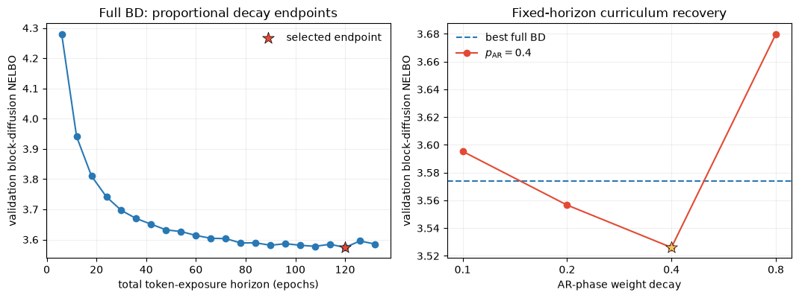

## What we can and cannot conclude

### Supported by the current experiments

- Pure BD on this setup has counted-parameter and token allocation exponents
  close to 0.5 across the four batch-128 profiles through \(10^{18}\).
- Attention and LM-head compute are material at these model sizes; naive
  `6*N*D` or `12*N*D` with counted parameters is not adequate.
- AR curriculum can substantially help an undertrained, oversized model at
  fixed FLOPs and model size.
- Re-optimizing model size makes the nominal compute-frontier gain small:
  \(p_{\mathrm{AR}}=0.4\) is within 1% of pure BD at every batch-matched
  budget and within 0.03% at \(10^{18}\).
- AR's cheaper attention makes the matched curriculum about 22% cheaper in
  realized FLOPs at high scale, despite matching pure-BD steps and tokens.
- At \(3\cdot10^{17}\), changing \(p_{\mathrm{AR}}\) from 0.4 to 0.15 moves
  the fitted optimum from 23.6M to 17.8M parameters while changing fitted
  loss by less than 0.2%.
- The one-shot \(10^{19}\), 176M run reached NELBO 3.00472, 2.04% below the
  preferred rolling-four loss forecast, at 18.14% accounted four-H100 MFU.
- With 25M unique tokens and a fixed 120-epoch horizon, increasing
  curriculum AR weight decay from 0.1 to 0.4 improves validation NELBO from
  3.59529 to 3.52605. This is 1.34% better than the selected full-BD
  endpoint; weight decay 0.8 closes the bracket on the high side.

### Not yet established

- Whether sub-1% frontier differences survive repeated seeds.
- Whether curriculum fractions guarantee the same loss after model size is
  re-optimized; the current observation covers one targeted alternative at
  one budget.
- Whether preserving or transforming optimizer state eliminates the
  transition cost.
- Whether the limited-data AR-weight-decay result survives repeated seeds,
  other model/data sizes, or jointly tuning the full-BD baseline's weight
  decay.
- Whether 176M is the \(10^{19}\) compute-optimal model size; one point does
  not localize an IsoFLOP minimum.
- How much of the favorable \(10^{19}\) loss residual comes from scale versus
  the batch-256 and lower-BD-LR changes.

## Recommended next experiments

1. Before interpreting sub-1% scaling-frontier differences causally, repeat the
   \(3\cdot10^{17}\) compute-optimal \(p_{\mathrm{AR}}=0.15\) and 0.4 points
   with multiple seeds.
2. Repeat the limited-data full-BD and AR-weight-decay comparison across
   seeds, then test whether its 0.4 optimum transfers to another unique-token
   budget or model size.
3. Test optimizer-state transition mechanics only if the seed repeats show a
   stable curriculum gap.

## Primary artifacts

- Pure-BD fit: `results/summary.json` and `results/optimal_allocation.csv`
- Fixed-FLOP curriculum: `results_curriculum/optimal_envelopes.csv`,
  `results_curriculum/observed_envelopes.csv`, and
  `results_curriculum/curriculum_runs.csv`
- Matched-step curriculum:
  `results_fixed_steps/fixed_steps_curriculum_through_2M_summary.json`
- Low-\(p_{\mathrm{AR}}\) diagnostics:
  `results_diagnostics/low_p_1e15_0p5M/summary.json`
- AR-LR diagnostic:
  `results_diagnostics/ar_lr_sweep_3e14_0p5M/summary.json`
- FlexAttention benchmark: `results_fixed_steps/benchmark_flex_2M.json`
- Pure-AR scale-up: `results_ar/summary.json`
- Matched \(p_{\mathrm{AR}}=0.4\) scale-up:
  `results_matched_p_ar_0p4/summary.json`
- One-shot \(10^{19}\) comparison:
  `results_matched_p_ar_0p4/one_shot_1e19_comparison.json`
- Targeted matched \(p_{\mathrm{AR}}=0.15\) profile:
  `results_matched_p_ar_0p15/summary.json`
- Fixed-size curriculum-fraction sensitivity:
  `results_matched_p_ar_fraction_sensitivity/summary.json`
- Cross-objective and LR comparisons: `results_followup_comparison/`
- Limited-data experiment plan: `results_data_efficiency/plan.json`
- Limited-data endpoint tables and selected comparison:
  `results_data_efficiency/full_bd_endpoints.csv`,
  `results_data_efficiency/curriculum_weight_decay.csv`, and
  `results_data_efficiency/summary.json`
